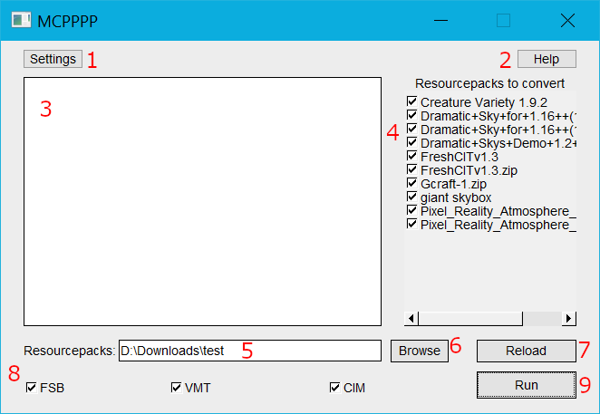
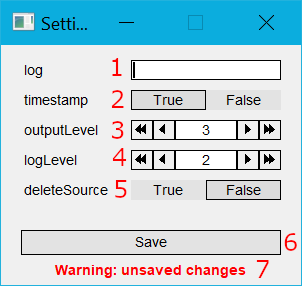
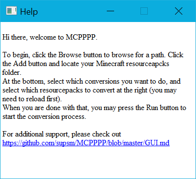
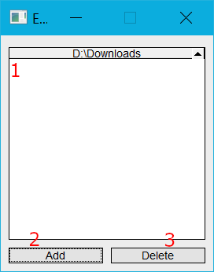

# GUI
This project uses [FLTK](https://github.com/fltk/fltk) for GUI. It should be relatively intuitive and easy to use.

**Mostly everything has a hover tooltip. Hover over something to get more information.**

## Main GUI Screen
  
1. **Settings** - opens Settings menu
2. **Help** - opens Help menu
3. **Output** - text that is normally outputted to console is outputted here
4. **Resourcepacks List** - list of resourcepacks found in folders, select which resourcepacks are to be converted using checkboxes
5. **Resourcepacks Location Manual Input** - manually input resourcepacks folder location, use ` // ` to seperate
6. **Resourcepacks Location Input** - opens Resourcepacks Location Input menu
7. **Reload** - reloads resourcepacks found in Resourcepacks List (4)
8. **Select/Deselct all** - select or deselect all resourcepacks for conversion
8. **Conversion Selector** - select which conversions to use (FSB, VMT, CIM)
9. **Run** - starts converting resourcepacks

## Settings Screen
  
**Note: 1-7 can be found at Use -> CLI -> Settings in [README.md](README.md). These can also be found in the hover toopltip.**
1. **autoDeleteTemp** - automatically delete `mcpppp-temp` folder on startup (default `true`)
2. **log** - a log file where logs will be stored (default `mcpppp-log.txt`)
3. **timestamp** - output a timestamp before each line, of the format `[hh:mm:ss]` (default `true`)
4. **outputLevel** - how much info should be outputted. 1 (min) outputs most info, 5 (max) outputs least info (default `3`)
5. **logLevel** - similar to outputLevel, but for log (default `2`)
6. **autoReconvert** - automatically reconvert packs instead of skipping them. **Could possibly overwrite your resourcepacks** (default `false`)
7. **fsbTransparent** - make fabricskyboxes converted skyboxes semi-transparent. Optifine does this internally, so turning on this setting will replicate optifine skyboxes more accurately. (default `true`)
8. **Save** - save settings to file
9. **Unsaved Changes Warning** - warns about unsaves changes

## Help Screen
  
Help screen appears if `mcpppp-config.json` isn't found, or when the Help button is clicked.

## Resourcepacks Location Input Screen
  
1. **Path Selector** - select a path to delete
2. **Add Path** - browse for your resourcepacks folder
3. **Delete Path** - delete the currently selected path
