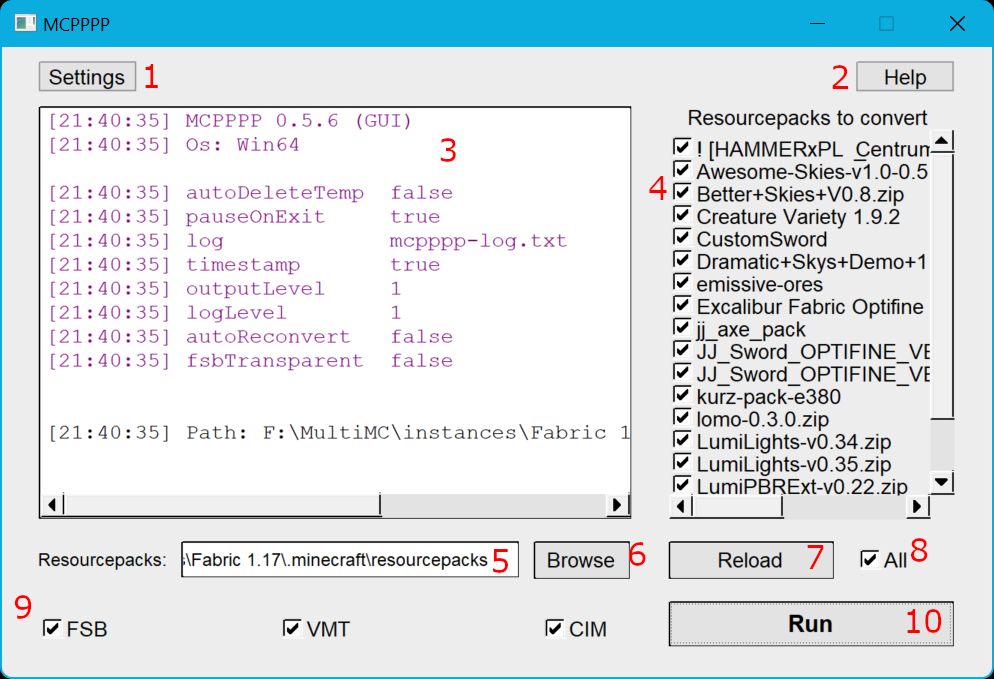
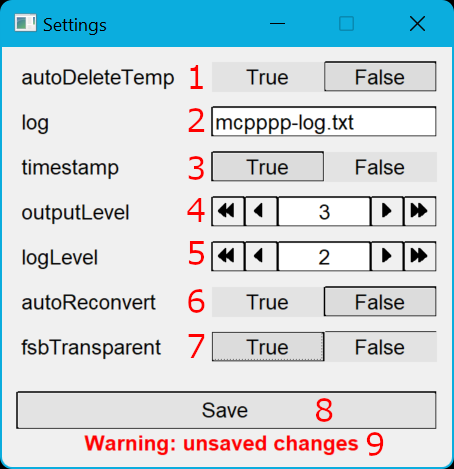

Mostly everything has a hover tooltip. Hover over something to get more information.

## Main GUI Screen
  
1. **Settings** - opens Settings menu
2. **Help** - opens Help menu
3. **Output** - text that is normally outputted to console is outputted here
4. **Resourcepacks List** - list of resourcepacks found in folders, select which resourcepacks are to be converted using checkboxes
5. **Resourcepacks Location Manual Input** - manually input resourcepacks folder location, use ` // ` to seperate
6. **Resourcepacks Location Input** - opens Resourcepacks Location Input menu
7. **Reload** - reloads resourcepacks found in Resourcepacks List (4)
8. **Conversion Selector** - select which conversions to use (FSB, VMT, CIM)
9. **Run** - starts converting resourcepacks

## Settings Screen
  
**Note: 1-5 can be found at Use -> CLI -> Settings in [README.md](README.md). These can also be found in the hover toopltip.**
1. **log** - A log file where logs will be stored (default `log.txt`)
2. **timestamp** - Automatically delete `mcpppp-temp` folder on startup (default `true`)
3. **outputLevel** - How much info should be outputted. 1 (min) outputs most info, 5 (max) outputs least info (default `3`)
4. **logLevel** - Similar to outputLevel, but for log
5. **deleteSource** - Delete source (optifine/mcpatcher) files when done converting. The pack will no longer be able to re-convert (default `false`)

## Help Screen
  
Help screen appears if `mcpppp.properties` isn't found, or when the Help button is clicked.

## Resourcepacks Location Input Screen
  
1. **Path Selector** - select a path to delete
2. **Add Path** - browse for your resourcepacks folder
3. **Delete Path** - delete the currently selected path